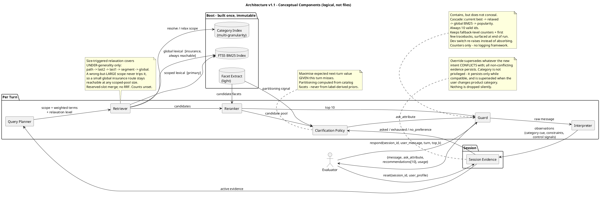

# Architecture v1.1 — TechJam Track 4 Shopping Copilot

> Supersedes the design sections of `M2_SYSTEM_DESIGN.md` (v1.0).
> v1.0 is retained as the diagnostic record; where the two disagree, **v1.1 wins**.
> Design only. No implementation. File references are repo-relative: `evaluator/local_evaluator.py:252`.
>
> **Revision note.** Three corrections applied after review, all conceptual and confined to existing
> sections: (i) a small global insurance route is now always reachable, because pool-size relaxation
> cannot detect a *wrong-but-large* category scope (§A.4, §B.4); (ii) category is ordinary evidence and
> may itself be superseded on override (§A.5, §A.6); (iii) the failure guard must keep failures
> observable in development rather than silently absorbing bugs (§A.3, §B.6).

## What changed from v1.0, and why

| # | v1.0 said | v1.1 says | Reason |
|---|---|---|---|
| 1 | E001 = reuse previous top-10 | **Removed.** Degradation-guard is an invariant, not an experiment | An identical list that missed cannot hit again. Value is near-zero |
| 2 | Clarification order `feature ≫ material ≫ color`; "slot 0 least informative" | **Removed from the architecture.** Attribute choice is derived at runtime from catalog-side pool partitioning | Those orderings came from evaluator-materialized intent cards built from public targets. Not admissible as design input |
| 3 | Override → demote (×0.3) by default | **Override → supersede conflicting constraints.** Demotion is an experimental variant | Semantically correct behaviour must be the default; the demotion argument rested on a hidden-field artifact |
| 4 | "Asking is free — always ask" | **No recommendation opportunity cost in the same response, but late hits still cost MTTC.** Per-turn objective is two-part | The original framing ignored the miss/turn penalty and overstated generality |
| 5 | Seven physical Python modules | **Conceptual boundaries only.** Minimal physical structure | Premature file-splitting before any experiment justifies it |
| 6 | Milestones as in v1.0 | Unchanged, with explicit ownership rules | Prevents M5 policy work leaking into M3 |
| 7 | KEEP thresholds +0.03 / +0.02 / −0.2 | **Removed.** TechnicalScore is the primary signal; scenario metrics are regression diagnostics | Those numbers were invented, not estimated from run-to-run variance |

### Evidence admissibility (governs everything below)

**Admissible** — the frozen catalog; published evaluator *mechanics* (protocol, scoring, reply
templates); the metric formulas; the user's own messages at runtime.

**Not admissible as design input** — anything computed from `ground_truth`, from intent cards the
evaluator materializes out of target products (`materialize_hidden_fields`,
`evaluator/local_evaluator.py:204-213`), or from the distribution of public targets.

Consequence for v1.0: its constraint-slot analysis, its "category ∧ 4 constraints → median pool 1"
result, and its attribute-yield ordering are **demoted to §E overfitting risks**. Two v1.0 claims that
survive because they are catalog-only or formula-only: the catalog has 1,115 coarse category buckets
with median size 8; and rank is worth ≈7.5× a turn (below).

**Honest consequence:** v1.0 asserted that state accumulation is "the single largest expected lift"
and cited a measured pool-collapse to support it. Stripped of that evidence, this is now a **plausible
but untested hypothesis**, and E002/E003 exist to test it rather than to confirm it.

---

## A. Architecture v1.1

### A.1 Per-turn objective

For a session that has not yet hit, each turn optimises two things at once:

1. **Current-turn top-10** — the only thing that can score this turn.
2. **Information acquired for the next turn, conditional on this turn missing.**

The second term is what `ask_attribute` buys. Formally the question should maximise expected
improvement *given that the current list misses* — a question is never a substitute for a good list,
only insurance against it.

**Why both terms matter (formula-derived, N = 200):**

```
Δscore(miss → hit at rank r, turn t) = 0.5/N + 0.3/(r·N) + 0.2·(11−t)/(10·N)
```

- rank 1 → rank 2 costs **0.15/N**
- one extra turn costs **0.02/N**
- a miss costs the full 11-turn MTTC penalty plus all of HR and MRR

So: rank ≫ turn, but turns are not free, and **late hits still hurt**. v1.0's "asking is free"
was wrong in the direction of complacency about MTTC.

### A.2 Pipeline

```
reset(session_id, user_profile)
    → create session record

respond(session_id, user_message, turn, top_k)
    → INTERPRET   message → observations (category cue, constraint text, control signals)
    → UPDATE      session evidence (add / supersede / mark-exhausted)
    → PLAN        scope + weighted evidence + relaxation level
    → RETRIEVE    category-scoped lexical, relaxable to global
    → RANK        BM25 → (M4) coverage-aware reranking
    → DECIDE      ask_attribute, chosen for next-turn value under a miss
    → EMIT        {message, ask_attribute, recommendations[10], usage}
       all wrapped in a guard that always yields 10 valid ids
```

### A.3 Conceptual components

These are **logical responsibilities, not files.** Physical structure stays minimal: everything begins
in `starter/agent.py`; a helper module is split out only when an experiment makes the file genuinely
unwieldy. No package skeleton is created in advance.

| Component | Responsibility | Status |
|---|---|---|
| **CatalogIndex** | FTS5 BM25 index (reuse starter) + category index at several granularities + light facet extraction | Essential — M3 |
| **Interpreter** | Message → category cue, constraint text spans, control signals (override / no-preference / no-new-info). Additive detectors; raw text always survives as untyped evidence | Essential — M3 minimal, M5 full |
| **SessionEvidence** | Accumulated constraints with attribute, source turn, status | Essential — M3 minimal plumbing, M5 full semantics |
| **QueryPlanner** | Evidence → scope + weighted terms + relaxation level | Essential — M3 |
| **Retriever** | Category-scoped lexical primary, plus a small global insurance route that stays reachable regardless of scoped-pool size; scope additionally relaxable | Essential — M3 |
| **Reranker** | Reorder candidates; constraint-coverage the leading hypothesis | Essential — M4 |
| **ClarificationPolicy** | Choose `ask_attribute` by expected next-turn value | Minimal M3/E002; adaptive M5 |
| **Guard** | Exception containment + degradation cascade, **plus fallback/error counters so failures stay visible during development** | Essential — M3 |
| **Fusion, facet route, profile prior, dense retrieval, LLM ranking** | — | Deferred; see §E |

### A.4 Retrieval

Category-scoped lexical retrieval is the primary route. Its justification is **label-free**: shoppers
name a product category in natural language, scoping to a named category is standard e-commerce
practice, and the catalog's own structure supports it (1,115 coarse buckets, median size 8 — a catalog
statistic, no labels involved).

Scoping must be **relaxable, never absolute**: full path → last-2 → last-1 → segment → global, plus
dropping the weakest facet constraint. Relaxation triggers on *pool size*, not on turn number, and it
addresses **under-generality** — a scope so narrow it cannot fill ten slots.

Relaxation alone is not sufficient. It fires on a size condition, so it cannot detect the more
dangerous failure: a **wrong-but-large** scope. If the user's phrasing resolves to a plausible
neighbouring category that comfortably yields hundreds of candidates, the pool never looks thin,
relaxation never triggers, and the target is silently unreachable for the whole session — an
uncorrectable recall failure that looks, from inside the agent, like everything working.

Therefore a **small global lexical insurance route runs alongside the scoped route and remains
reachable regardless of scoped-pool size.** The scoped route supplies the large majority of
candidates; the insurance route reserves a modest share for globally strong lexical matches that the
scope excluded. Exact candidate counts and the split are deliberately unprescribed — they are tuning
parameters for E001, not architecture.

This is a two-route retriever, not a fusion architecture: a simple reserved-slot merge, no RRF and no
score calibration. Additional heterogeneous routes remain deferred (§E).

### A.5 Session state

Minimum viable shape. Fields exist only where a component reads them.

```python
Evidence:  text, attribute, polarity, source_turn, status   # status: active | superseded | exhausted
Session:   profile, category_hypothesis, evidence[], asked[],
           exhausted{}, no_preference{}, relaxation_level, turn_count
```

- **Accumulation** — append; nothing is silently dropped.
- **Override** — conflicting prior constraints become `superseded` (see §A.6). All **non-conflicting**
  evidence persists. The category hypothesis is ordinary evidence subject to the same test: it persists
  only while it remains compatible with the new intent, and is itself superseded when the user changes
  product category.
- **No-preference** — recorded as a signal to stop asking *and* to stop filtering on that dimension.
  Rendering it as a filter would be a bug.
- **Exhausted** — attribute yielded nothing; do not re-ask.

`reset()` creates a fresh session record and never touches the shared, immutable index. `respond()`
updates evidence exactly once, before planning.

### A.6 Intent override — semantic replacement (default)

When the user signals a change of intent, the **conflicting** prior constraints are marked
`superseded` and stop contributing. This is the semantically correct reading of "actually, ignore my
earlier preference," and it is what a real shopping assistant must do.

Scope of the replacement is **determined by conflict, not by a fixed list of protected fields.** All
non-conflicting evidence persists; everything the new intent contradicts is superseded. Blanket state
erasure is as wrong as no erasure.

**Category is not privileged.** It is evidence like any other and is tested the same way. It persists
only while it remains compatible with the new intent, and is superseded when the user changes product
category — "actually, I need boots instead of sandals" invalidates the scope itself. When category is
superseded, constraints that only made sense under the old category lose their basis and must be
re-tested for compatibility rather than carried forward automatically. Asserting that category always
survives would produce exactly the wrong-but-confident scope that §A.4's insurance route exists to
mitigate, and would do so with the agent's full conviction.

v1.0 defaulted to demotion instead. That argument depended on an artifact of the evaluator's
hidden-field construction and is therefore inadmissible as an architectural default. Demotion survives
only as the E005 variant.

Relevant evaluator mechanic (admissible, from source): override sessions cannot score before the
override is applied (`evaluator/local_evaluator.py:252`, `:234`), so those sessions carry a hard MTTC
floor regardless of what the agent does.

### A.7 Clarification — evaluator-aware policy

**Evaluator mechanics (admissible):**
- `ask_attribute = None` → the simulator returns a fixed, information-free reply
  (`evaluator/local_evaluator.py:171`).
- Recommendations are scored on every turn, **including turns that carry a question**.

**Therefore:** returning a list and asking a question in the same response has **no direct
recommendation opportunity cost**. This is a property of this evaluator, not a universal product rule
— in a real product, questions carry UX cost and a good assistant asks fewer of them.

**But late hits still cost MTTC**, so the policy is not "always ask" — it is: *always return the best
available list; ask when a question has positive expected next-turn value; choose the attribute that
best partitions the current candidate pool.* Pool partitioning is computed from **catalog facets**, not
from any label-derived attribute prior.

Under this evaluator, a question is usually worth asking while unexhausted attributes remain. That is a
conclusion the policy should *reach*, not a rule hard-coded into it.

---

## B. Key architectural invariants

1. **Label isolation.** The agent reads only `session_id`, `user_profile`, `user_message`, `turn`,
   `top_k`, and the frozen catalog. No ground truth, no sample ids, no evaluator-internal fields.
2. **Mechanism over statistic.** Every component is justified by a label-free causal mechanism.
   Public-set numbers may validate a component; they may never be its reason for existing.
3. **Always ten.** Every turn returns exactly 10 valid unique `parent_asin`s whenever the catalog can
   supply them. Recommendations are never withheld in order to ask a question.
4. **Scoping is never the only path to a candidate.** Every filter has a relaxation path terminating
   at unfiltered global retrieval, *and* a small global insurance route remains reachable regardless of
   scoped-pool size. Size-triggered relaxation covers under-generality; the insurance route covers a
   wrong-but-large scope, which no size condition can detect. No query path may return an empty or
   short list.
5. **No silent state loss.** Evidence transitions (`superseded`, `exhausted`) are explicit and
   inspectable; nothing is dropped without a recorded reason.
6. **Failure containment without failure concealment.** Exceptions never escape `respond()` —
   degradation cascade: current best → relaxed retrieval → global BM25 (starter behaviour) → catalog
   popularity. But the guard must never let an implementation bug masquerade as a legitimate low score.
   It therefore keeps lightweight in-process diagnostics: per-session counters for how often each
   fallback level was reached, and the exception type plus captured traceback string for the first few
   distinct failures. These are surfaced at end of run and reviewed alongside metrics. A development
   switch additionally re-raises instead of absorbing, so bugs fail loudly while the submitted default
   still contains. **Counters and a captured string — no logging framework, no new dependency.**
7. **Offline and deterministic.** No network on the scored path. Same inputs → same outputs, so
   ablations are interpretable.
8. **No degradation guard as an experiment.** Never letting an information-free reply overwrite a
   better query is a correctness property of the Interpreter, measured only as "did not regress."

---

## C. M3–M7 ownership boundaries

**Governing rule:** minimal state plumbing may appear before M5 *only when an experiment cannot be run
without it*. Full dialogue policy is M5's. "It would be convenient" is not sufficient justification.

| Milestone | Owns | Explicitly does not own | Metrics watched |
|---|---|---|---|
| **M3 Retrieval** | CatalogIndex + category index; category-scoped retrieval with relaxation; Guard; **minimal** interpretation and evidence plumbing needed by E002/E003 | Reranking; adaptive question selection; override semantics; boundary logic | HR@10 primary; MTTC secondary |
| **M4 Ranking** | Constraint-coverage reranking; field weighting; IDF-aware evidence weighting; candidate-pool sizing | Dialogue policy; dense retrieval; fusion (unless E004 shows a single route is limiting) | **MRR** primary; HR@10 secondary |
| **M5 Conversation Intelligence** | Full override semantics; boundary and exhaustion handling; adaptive attribute selection; relaxation tuning; customer-facing message quality | New retrieval or ranking features | MTTC/Efficiency; `intent_override` and `boundary` scenario buckets |
| **M6 Ablation / Robustness** | Ablation harness; **paraphrase-perturbation stress test** (local wrapper; evaluator untouched); latency, memory, determinism checks; run-to-run variance estimate; **review of the guard's fallback/error counters** to confirm no bug is hiding behind a legitimate-looking score | Any new capability | All four, plus stability |
| **M7 Submission** | README, reproduction command, report, offline declaration, honest `usage`, demo transcript, final run | Anything algorithmic — frozen after M6 | No regression vs best recorded |

**Why E002/E003 sit in the M3 window despite touching dialogue:** with `ask_attribute` permanently
null the information channel is closed, so retrieval and ranking can only ever be evaluated at turn-1
evidence levels. A *fixed, non-adaptive* clarification channel is the minimum plumbing that lets M3/M4
be measured under realistic evidence. The policy stays deliberately dumb until M5.

---

## D. Revised roadmap, E001–E006

Decision rule for all of them: **overall TechnicalScore is the primary signal; scenario metrics are
regression diagnostics.** No fixed numeric thresholds — v1.0's were invented rather than estimated.
Before leaning on small deltas, M6 should establish a run-to-run variance estimate; until then, treat a
small improvement with no scenario regression as KEEP, and a small improvement alongside a scenario
collapse as INVESTIGATE, not KEEP.

| ID | Hypothesis (single) | Minimal change | Primary metric | Watch for | Decision |
|---|---|---|---|---|---|
| **E001** | Scoping lexical retrieval to the category the user names, with a small global insurance route and graceful relaxation, improves recall over unscoped BM25. | Category index + scope + relaxation + insurance route, retrieval only. **No** clarification, state, or reranking changes. | HR@10 | Both scope failures: under-generality (pool cannot fill 10) *and* wrong-but-large scope. Count pool sizes and how often the insurance route supplies a returned id | KEEP on TechnicalScore gain with no scenario collapse |
| **E002** | Opening the clarification channel yields information the agent can act on; a fixed, simple attribute policy is enough to demonstrate it. | Emit a non-null `ask_attribute` under a fixed, label-free rule. Retrieval and ranking frozen at E001. Minimal plumbing to record what was asked | HR@10, MTTC | `boundary` bucket; turns spent on attributes that yield nothing | KEEP on TechnicalScore gain |
| **E003** | Carrying disclosed evidence across turns beats using only the current message. | Accumulate evidence into the query. E002 policy held fixed | HR@10, MTTC | Query dilution — accumulated terms may swamp the discriminative ones. This is E004's setup | KEEP on TechnicalScore gain; record dilution evidence either way |
| **E004** | Ranking by *how many* accumulated constraints a product satisfies beats BM25's single-rare-token bias. | Coverage-aware reranking over the E003 pool | **MRR** | Long generic text over-scoring on coverage; may need IDF weighting to interpret | KEEP on TechnicalScore gain; MRR is the mechanism check |
| **E005** | Intent override is best handled by superseding conflicting constraints. | Variants: (a) supersede-conflicting [default], (b) demote, (c) erase-all | `intent_override` bucket | Overall score may barely move — 15% of sessions with a hard MTTC floor | KEEP the best variant; **record all three**, since this is where v1.0 was wrong |
| **E006** | Choosing the attribute that best partitions the current candidate pool beats a fixed order. | Adaptive selection from catalog facets. Everything else frozen | MTTC/Efficiency | Adaptive choice may pick attributes the user cannot answer | KEEP on TechnicalScore gain |

**Sequencing logic:** E001 isolates retrieval. E002 opens the channel. E003 isolates accumulation.
E004 isolates ranking. E005–E006 are M5 semantics and policy. Each changes one thing; E003 and E004
are deliberately adjacent because E003's expected failure mode (dilution) is exactly what E004 fixes,
and reading them together is more informative than reading either alone.

**Removed from v1.0:** the top-10 reuse experiment. Its one narrow residual value — an
`intent_override` session whose early list contained the target before `override_applied` gated the
hit — is not worth an experiment slot and is subsumed by E005.

---

## E. Decisions intentionally left experimental

Not settled by this document. Each needs evidence before entering the architecture.

| Question | Default for now | Resolved by |
|---|---|---|
| Override: supersede vs demote vs erase | Supersede conflicting | E005 |
| Attribute selection: adaptive vs fixed | Fixed and simple | E006 |
| Additional heterogeneous routes + RRF fusion | Scoped primary + small global insurance only, merged by reserved slots — no RRF, no score calibration | Only if E001/E004 show the two-route mix is limiting |
| Facet route for thin-evidence sessions | Not built | M4/M5 evidence |
| `user_profile` signal | Unused | Late ablation; tags look generic, expect little |
| Dense / hybrid retrieval | Not built | Only if lexical plateaus **and** a model can be bundled offline |
| LLM reranking | Not on the scored path | Organizer confirmation of network access; optional flag at most |
| Physical module split | Single file | When a file becomes genuinely unwieldy |

### Documented overfitting risks (observations, never design inputs)

These are recorded so we recognise the trap, not so we exploit it. Risk #1 is the exception: it was
recorded as a prohibition, later overruled by measurement, and now stands as a disclosed accepted
risk. It is annotated in place below rather than quietly rewritten.

1. **Evaluator-materialized intent cards.** The public set ships no `intent_card`, so the evaluator
   derives one from the target product. Constraint text is therefore verbatim product text. Earlier
   measurement showed category plus all disclosed constraints collapsing the pool to a median of 1 —
   an artifact of that construction, not a property of the task.

   **v1.1 wrote: "Any mechanism relying on exact substring identity is forbidden." That prohibition
   was overruled by measurement at E010 and is no longer the architecture's position.** It is
   preserved verbatim here rather than deleted, because the reasoning that produced it was sound and
   the risk it names is real and now realised.

   What overruled it: E010's proximity reranker scores each candidate by the longest contiguous
   n-gram of the user's own words appearing literally in the product's token stream, and it is the
   system's primary ranking signal. E011 then made it decisive by reranking a 100-deep pool before
   truncating to ten. 98.9% of hits carry non-zero proximity and **every** rank-1 hit does, so the
   scored path now rests on exact substring identity almost entirely — precisely the mechanism this
   rule forbade.

   The prohibition is downgraded to a **disclosed, accepted, concentrated risk**, on these grounds
   and no others:

   - `docs/final_evaluation_faq.md` §1 states the final evaluation uses the same deterministic
     customer-message templates with no undisclosed natural-language paraphrases. That is an
     organizer guarantee we are relying upon, not a property we verified.
   - The rule's own danger clause still holds and is the reason this is a risk rather than a
     non-issue: a paraphrase-driven failure **would not appear as a local regression**. If the
     guarantee in FAQ §1 did not hold, we would not find out from the public set.
   - D012, the paraphrase-stress diagnostic built to measure exactly this exposure, was **CANCELLED
     with no result** once FAQ §1 was published. No number from it may be cited. The exposure is
     therefore disclosed and argued, never measured.

   This entry and the "depends on exact substring matching" bullet in `README.md`'s Limitations state
   the same position; if they ever diverge again, the README is the reader-facing text and this is the
   architectural record, and both must be corrected together.
2. **Constraint slot positions.** The ordering and relative informativeness of card slots follow from
   evaluator construction order. Not admissible for clarification ordering. Removed from v1.1.
3. **Attribute-yield distribution.** Measured over public targets' materialized cards. Replaced by
   runtime, catalog-side pool partitioning.
4. **Public-target category bucket sizes.** Target-derived. The catalog-side bucket distribution is
   admissible; the target-conditioned one is not.

The M6 roadmap planned a paraphrase-perturbation test specifically to detect whether any of these
leaked in. **It was built as D012 and then CANCELLED with no result**, after `docs/final_evaluation_faq.md`
§1 stated the final evaluation introduces no undisclosed paraphrases, which falsified the assumption
the test existed to probe. No number it produced may be cited. The consequence is that risks #1-#4
above are disclosed and argued, not empirically bounded — there is no leak detector in this project.

---

## F. Updated PlantUML component diagram



---

## Baseline reference (E000, unchanged official starter)

| Metric | Overall | | Scenario | HR@10 | MRR | MTTC |
|---|---|---|---|---|---|---|
| HitRate@10 | 0.125 | | buying | 0.2375 | 0.126508 | 8.625 |
| MRR | 0.068034 | | browsing | 0.025 | 0.004514 | 10.75 |
| MTTC | 9.81 | | intent_override | 0.133333 | 0.104167 | 10.066667 |
| Efficiency | 0.119 | | boundary | 0.0 | 0.0 | 11.0 |
| TechnicalScore | 0.10671 | | | | | |
